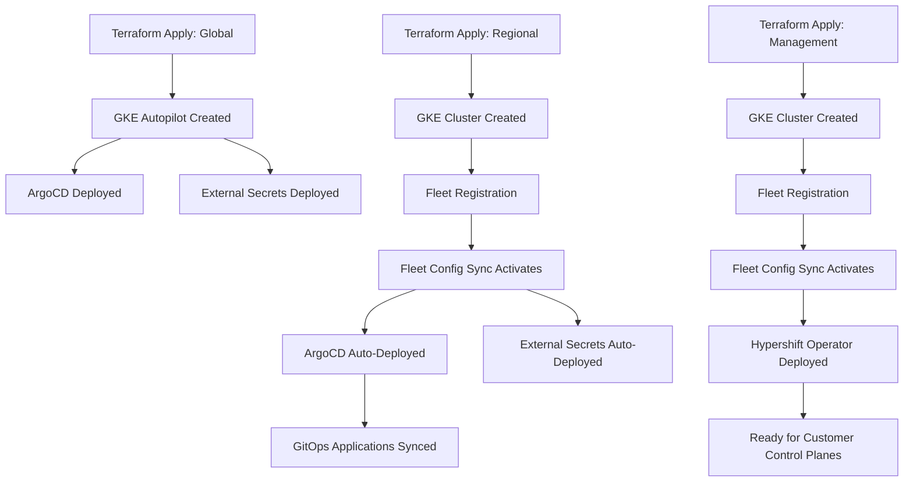

# GCP HCP - Deployment Resources (Proposed)

This directory contains **proposed** documentation and examples for deploying GCP HCP infrastructure using Terraform and Fleet Config Sync.

## Overview

This proposed GCP HCP deployment pattern demonstrates an **alternative approach** to the ROSA HCP GitHub Actions pattern, leveraging GCP-native automation:
- **Manual Terraform** or optional Cloud Build (no GitHub Actions required)
- **Fleet Config Sync** for autonomous cluster bootstrapping
- **GCP Secret Manager** with External Secrets Operator
- **Workload Identity** for keyless authentication

## Deployment Stages

### Global Infrastructure

- **[integration-global.tf](../terraform-examples/integration-global.tf)** - Development/Integration environment
  - GKE Autopilot cluster
  - ArgoCD bootstrap
  - External Secrets Operator
  - Developer-friendly settings

- **[production-global.tf](../terraform-examples/production-global.tf)** - Production environment
  - Private GKE cluster
  - Multi-region GCS replication
  - Binary Authorization
  - Enhanced security

### Regional Infrastructure

- **[integration-regional-cluster.tf](../terraform-examples/integration-regional-cluster.tf)** - Regional clusters
  - VPC and network configuration
  - Fleet registration for autonomous bootstrap
  - Cloud Workflows for operations
  - Hosted cluster DNS delegation

### Management Clusters

- Deploy via Terraform modules (similar to regional)
- GKE cluster for Hypershift
- Cross-project Fleet registration
- PSC (Private Service Connect) subnets

## Usage

### Quick Start

1. **Deploy Global Infrastructure**:
   ```bash
   cd terraform/config/global/integration/main/us-central1

   # Initialize and apply
   terraform init
   terraform apply

   # Create GitHub credentials in Secret Manager
   PROJECT_ID=$(terraform output -json | jq -r '.global.value.project_id')
   gcloud secrets create argocd-repo-creds --project=$PROJECT_ID
   ```

2. **Deploy Regional Cluster**:
   ```bash
   cd terraform/config/region/integration/main/us-central1
   terraform init && terraform apply

   # Watch Fleet Config Sync bootstrap ArgoCD automatically
   gcloud beta container fleet config-management status
   ```

3. **Deploy Management Cluster**:
   ```bash
   cd terraform/config/management-cluster/integration/main/us-central1/mgmt-1
   terraform init && terraform apply
   ```

### Customization

Customize Terraform configurations for your environment:

- **GCP Project Settings**: Update `parent_folder_id`, project IDs
- **IAM Bindings**: Configure team group permissions
- **Network Settings**: VPC CIDR ranges, subnet configurations
- **ArgoCD Configuration**: Git repository URLs, sync policies
- **Feature Flags**: Enable/disable deletion protection, external access

## Deployment Flow



## Features

✅ **Autonomous Bootstrap** - Fleet Config Sync deploys ArgoCD automatically
✅ **No GitHub Actions Required** - Manual Terraform or optional Cloud Build
✅ **Native Secret Management** - GCP Secret Manager with External Secrets Operator
✅ **Workload Identity** - Keyless authentication (no service account keys)
✅ **GCS State Management** - Built-in locking (no DynamoDB needed)
✅ **Multi-environment** - dev/integration/stage/prod support
✅ **Private Clusters** - GKE with Cloud NAT for outbound access
✅ **Fleet Management** - Centralized cluster registration and policies

## Key Differences from ROSA HCP

| **Aspect** | **ROSA HCP (Proposed)** | **GCP HCP (Proposed)** |
|------------|-------------------------|------------------------|
| **Deployment Automation** | GitHub Actions (required) | Manual Terraform or Cloud Build (optional) |
| **Cluster Bootstrap** | ECS task runs kubectl/helm | Fleet Config Sync (autonomous) |
| **Secret Management** | HashiCorp Vault (external) | GCP Secret Manager (native) |
| **Authentication** | AWS IAM (IRSA) | Workload Identity (native) |
| **State Locking** | S3 + DynamoDB | GCS (built-in) |
| **Multi-account** | Cross-account IAM roles | Cross-project Fleet registration |

## Documentation

For complete setup instructions and detailed explanations:
- **[Deployment Guide](deployment-guide.md)** - Full deployment instructions
- **[Secret Manager Integration](secret-manager-integration.md)** - GCP Secret Manager with External Secrets Operator
- **[Infrastructure Comparison](../../infrastructure-comparison.md)** - Three-platform comparison

## Notes

- These are **proposed patterns** for demonstration and comparison
- Fleet Config Sync eliminates the need for external CI/CD for cluster bootstrap
- Always test in dev/integration environments first
- Review security settings before deploying to production
- Use Workload Identity instead of service account keys

## Troubleshooting

### Fleet Config Sync Not Syncing

```bash
# Check status
gcloud beta container fleet config-management status

# Check logs
kubectl logs -n config-management-system -l app=config-management-operator
```

### Workload Identity Not Working

```bash
# Verify IAM binding
gcloud iam service-accounts get-iam-policy <SA_EMAIL> --format=json

# Check ServiceAccount annotation
kubectl get sa external-secrets -n external-secrets-system -o yaml
```

### ExternalSecret Not Syncing

```bash
# Check ExternalSecret status
kubectl describe externalsecret <NAME> -n <NAMESPACE>

# Check ESO logs
kubectl logs -n external-secrets-system -l app.kubernetes.io/name=external-secrets
```

For more troubleshooting, see the [Deployment Guide](deployment-guide.md#troubleshooting).

## Additional Resources

- **[GCP HCP Repository](https://github.com/openshift-online/gcp-hcp-infra)** - Reference implementation
- **[Fleet Config Sync Docs](https://cloud.google.com/kubernetes-engine/docs/add-on/config-sync/overview)** - Official GCP documentation
- **[External Secrets Operator](https://external-secrets.io/)** - ESO documentation
- **[Workload Identity Guide](https://cloud.google.com/kubernetes-engine/docs/how-to/workload-identity)** - GCP authentication
