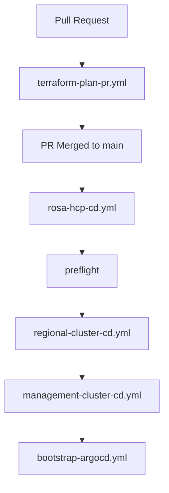

# ROSA HCP - Example GitHub Workflows (Proposed)

This directory contains **proposed** example GitHub Actions workflows for deploying ROSA HCP infrastructure using Terraform.

## Overview

These workflows are **reference implementation proposals** modeled after the ARO-HCP deployment pattern, adapted for AWS and Terraform. They demonstrate how ROSA HCP could adopt a similar GitHub Actions-based deployment approach.

## Workflows

### Main Orchestrator

- **[rosa-hcp-cd.yml](rosa-hcp-cd.yml)** - Main continuous deployment workflow
  - Orchestrates all deployment stages
  - Supports manual trigger with environment selection
  - Auto-triggers after container image builds

### Infrastructure Deployment

- **[regional-cluster-cd.yml](regional-cluster-cd.yml)** - Regional Cluster deployment
  - Deploys EKS Regional Cluster (RC)
  - Provisions VPC, RDS, IoT Core, API Gateway, etc.
  - Reusable workflow with environment parameters

- **[management-cluster-cd.yml](management-cluster-cd.yml)** - Management Cluster deployment
  - Deploys EKS Management Cluster(s) (MC)
  - Supports multiple clusters via matrix strategy
  - Cross-account deployment support

### Bootstrap & Validation

- **[bootstrap-argocd.yml](bootstrap-argocd.yml)** - ArgoCD bootstrap
  - Installs ArgoCD on Regional Cluster
  - Applies ApplicationSets for GitOps

- **[terraform-plan-pr.yml](terraform-plan-pr.yml)** - PR validation
  - Runs Terraform plan on pull requests
  - Posts plan output as PR comment
  - Validates changes before merge

## Usage

### Quick Start

1. **Copy workflows to your repository**:
   ```bash
   cp examples/rosa/workflows/*.yml .github/workflows/
   ```

2. **Configure GitHub Secrets** (see [infrastructure-comparison.md](../infrastructure-comparison.md#4-required-github-secrets)):
   - `AWS_REGION`
   - `AWS_ACCOUNT_ID_REGIONAL`
   - `AWS_ACCOUNT_ID_MANAGEMENT`
   - `AWS_ROLE_TO_ASSUME_REGIONAL`
   - `AWS_ROLE_TO_ASSUME_MANAGEMENT`
   - `TERRAFORM_STATE_BUCKET`
   - `TERRAFORM_STATE_DYNAMODB_TABLE`

3. **Set up AWS OIDC** (see [infrastructure-comparison.md](../infrastructure-comparison.md#2-github-oidc-setup-for-aws))

4. **Trigger workflow**:
   - Navigate to Actions → "ROSA HCP Continuous Deployment"
   - Click "Run workflow"
   - Select environment (dev/int/stage/prod)

### Customization

These workflows are templates. Customize them for your needs:

- **Environment variables**: Update `TERRAFORM_VERSION`, regions, etc.
- **Deployment stages**: Add/remove stages in main workflow
- **Validation rules**: Modify preflight checks
- **Matrix strategy**: Adjust management cluster count
- **Terraform variables**: Update `.tfvars` file paths

## Workflow Dependencies



## Features

✅ **OIDC Authentication** - Secure, keyless AWS access
✅ **Multi-environment** - dev/int/stage/prod support
✅ **Reusable Workflows** - DRY principle with `workflow_call`
✅ **State Management** - S3 backend with DynamoDB locking
✅ **Cross-account** - Multi-account AWS deployment
✅ **PR Validation** - Terraform plan on pull requests
✅ **Concurrency Control** - Environment-level locking
✅ **Artifact Storage** - Save Terraform outputs

## Documentation

For complete setup instructions and detailed explanations, see:
- [infrastructure-comparison.md](../infrastructure-comparison.md) - Full deployment guide

## Notes

- These are **examples** and may need adaptation for your environment
- Always test in dev/sandbox environments first
- Review security settings before deploying to production
- Ensure compliance with your organization's policies

## Support

For issues or questions about these workflows:
1. Review the [Troubleshooting section](../infrastructure-comparison.md#troubleshooting)
2. Check GitHub Actions logs for detailed error messages
3. Verify AWS IAM permissions and OIDC configuration
